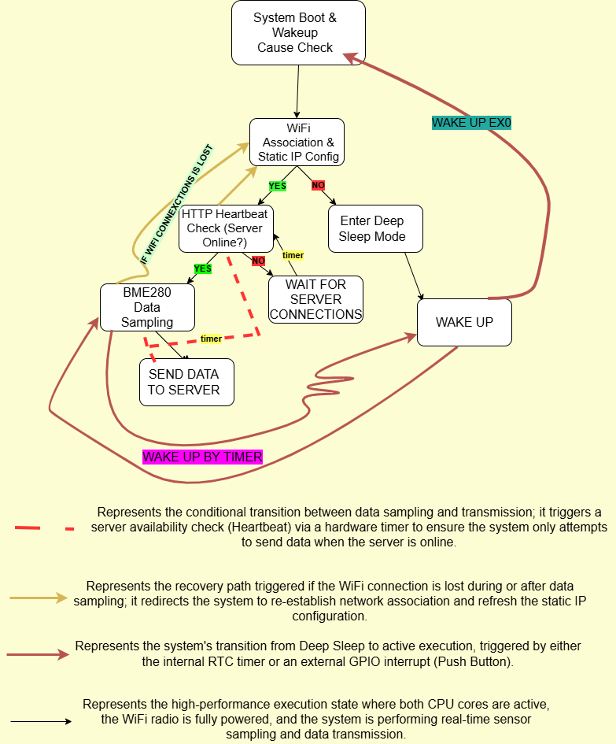

# ESP32-WIFI-PROJECT
This project collects data from a sensor and processes it using an RTOS to ensure reliable, real-time task management. The system transmits the measured data to a remote server for monitoring and analysis. Low-power techniques are applied to optimize energy consumption and extend battery life.

## WORKFLOW REPRESENTATION
The representation of the project workflow is presented below:

# System Workflow

The firmware follows a sophisticated logic designed to balance real-time monitoring with extreme power efficiency. The system operation is divided into four main stages:

## 1. Power-On & Wakeup Analysis

Upon booting or waking from sleep, the system immediately evaluates the **Wakeup Cause**:

- **Timer Wakeup (Low Power Path)**  
  The ESP32 wakes up every 2 minutes to sample sensors and update the LCD locally.  
  The WiFi radio remains disabled to minimize current draw.

- **External Interrupt (Full Power Path)**  
  Triggered by a physical button (GPIO 32), the system prepares for a full data transmission cycle to the server.

## 2. Dual-Core Task Management

Leveraging the FreeRTOS scheduler, the workload is distributed across both CPU cores to ensure timing precision:

- **Core 0 – Communication**  
  Manages the WiFi stack and HTTP client operations.  
  Uses *Fast Connect* logic by retrieving **BSSID**, **Channel**, and **Static IP** credentials from **RTC RAM**, reducing connection time by several seconds.

- **Core 1 – Sensing & UI**  
  Handles the I2C bus for the **BME280** sensor and the **LCD 1602** display, ensuring the user interface remains responsive regardless of network latency.

## 3. Smart Network & Server Validation

To prevent the system from hanging or wasting energy on failed requests, a **Heartbeat mechanism** is implemented:

- **WiFi Association**  
  The system monitors the connection state via event handlers.  
  If the link is lost, it attempts a background re-association.

- **Server Heartbeat**  
  Before sending data, a hardware timer triggers a periodic check to verify if the Flask server is online.  
  Sensor data is transmitted **only if the server responds with `HTTP 200 OK`**.

## 4. Connection Maintenance & Conditional Deep Sleep

Unlike standard devices that sleep immediately after completing a task, this system prioritizes network persistence:

- **Active State**  
  The device remains fully powered while the network is stable, allowing continuous monitoring and rapid data updates.

- **Recovery Grace Period**  
  If the WiFi connection is lost, the system enters a recovery state.  
  A hardware timer is initialized with a **120-second window** to attempt network restoration.

- **Deep Sleep as a Repercussion**  
  Deep Sleep is treated as a contingency measure.  
  If the recovery timer expires without a successful reconnection, the system enters Deep Sleep to prevent total battery depletion, acting as a fail-safe against prolonged network instability.

