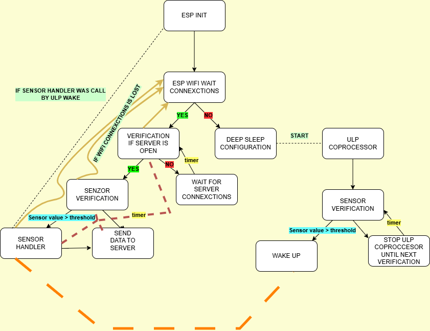

# ESP32-WIFI-PROJECT
This project collects data from a sensor and processes it using an RTOS to ensure reliable, real-time task management. The system transmits the measured data to a remote server for monitoring and analysis. Low-power techniques are applied to optimize energy consumption and extend battery life.

## WORKFLOW REPRESENTATION
The representation of the project workflow is presented below:

## Workflow Description
- The workflow begins with the **configuration of all system peripherals**, including GPIOs, I2C, timers, and the **Wi-Fi peripheral**. An LCD display communicating over I2C through the PCF8574 expander is initialized, along with the BME280 sensor used for environmental data acquisition. Once all peripherals are configured, the **ESP initialization** phase is completed and the system enters the Wi-Fi connection handling state.

- The ESP then **waits for Wi-Fi connections**. If a connection is successfully established, the system verifies whether the **remote server is available**. When the server is open, **sensor verification** is performed by reading data from the BME280 sensor. If the sensor values exceed a predefined threshold, the **sensor handler** processes the data and **sends it to the server**. Operations marked with **timer** are executed on a timer interrupt, ensuring periodic and deterministic checks without blocking the main execution.

- If the Wi-Fi connection is not available or is lost, the system transitions to **deep sleep configuration** to minimize power consumption. In this state, the **ULP coprocessor is started**, meaning it operates independently while the main CPU is asleep. The ULP periodically performs **sensor verification** on a timer interrupt and continuously monitors the sensor at very low power.

- When the ULP detects that a sensor value exceeds the defined threshold, it **wakes up the main processor**. The ESP resumes operation and checks the Wi-Fi connection status. If the device is connected to the internet, it verifies server availability and transmits the sensor data.  

- If no Wi-Fi connection is available, the ESP performs the required local processing, attempts to reconnect, and verifies network availability again. If the connection is still not established, the system **returns to low-power operation**, entering deep sleep and stopping the ULP coprocessor until the next scheduled verification.

